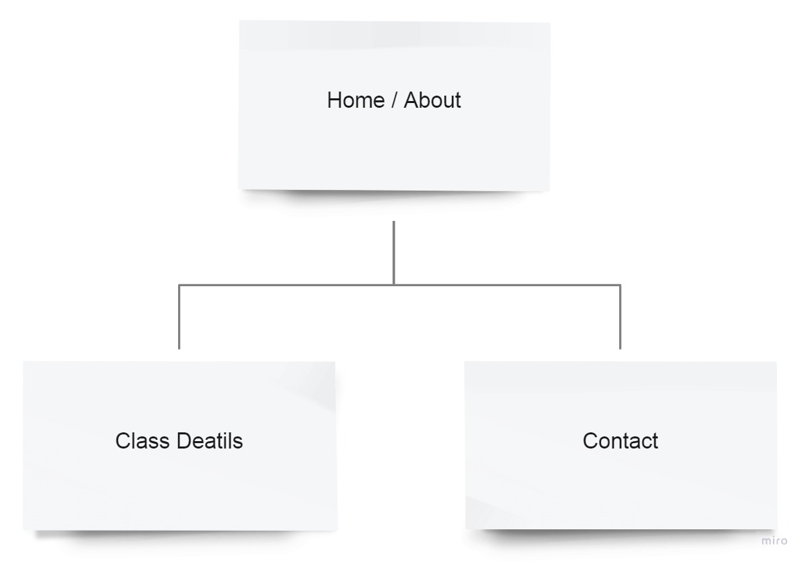
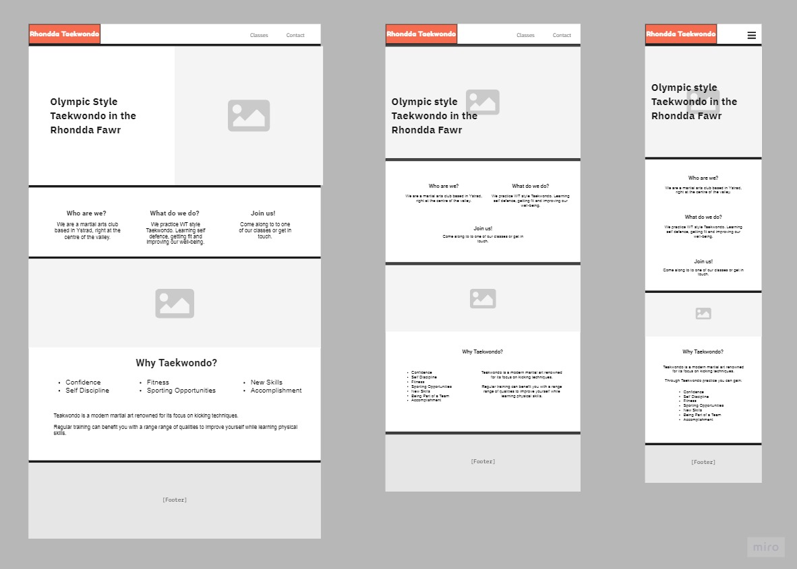

# Rhondda Taekwondo

A responsive website for a local martial arts club in the Rhondda valley. The the website serves as promotion for the club, a point to discover essential details about the classes and opportunities to make contact.

**The live project is available on GitHub Pages: [Rhondda Taekwondo](#)**

## Table of Contents
- [Features](#features)
  * [Current Features](#current-features)
  * [Future Features](#future-features)
- [User Experience Design](#user-experience-design)
  * [Strategy](#strategy)
  * [Scope](#scope)
    + [Problems to Solve](#problems-to-solve)
    + [User Stories](#user-stories)
  * [Structure](#structure)
  * [Skeleton](#skeleton)
    + [Navigation Tree](#navigation-tree)
    + [Wireframes](#wireframes)
  * [Surface](#surface)
- [Technologies Used](#technologies-used)
  * [Languages](#languages)
  * [Frameworks](#frameworks)
  * [Other Services and Software](#other-services-and-software)
- [Testing](#testing)
  * [Functionality](#functionality)
  * [Usability](#usability)
  * [Responsiveness](#responsiveness)
  * [Unfixed Bugs](#unfixed-bugs)
- [Deployment Instructions](#deployment-instructions)
- [Acknowledgements](#acknowledgements)
  * [Content](#content)
  * [Media](#media)
  * [Thanks](#thanks)

## Features

A summary of the features in the project.

### Current Features
These features have been implemented in the project.

 - Feature One
	 * Detail of the feature
	 * Detail of the feature
	 

 - Feature Two
	 * Detail of the feature
	 * Detail of the feature
	 

 - Feature Three
	 * Detail of the feature
	 * Detail of the feature
	 

 - Feature Four
	 * Detail of the feature
	 * Detail of the feature
	 

### Future Features
Possible features to be considered for future releases.
- Feature One
	 * Detail of the feature
	 * Detail of the feature

- Feature Two
	 * Detail of the feature
	 * Detail of the feature

## User Experience Design

### Strategy

The website is aimed at prospective students considering joining a martial arts club and parents looking to chose a martial arts club for their child or children.

Users will expect responsive design and seamless use of familiar conventions to access the information that they want to see as simply as possible.

Both the user and owner should mutually benefit from a sense on confidence being established in the club, leading to users being inspired to either join up or make contact.

### Scope

#### Problems to Solve
People currently don't know:
 - the club exists
 - what the club does
 - what the club offers
 - how to get it from the club
 
Neither are they:
 - joining the club
 - engaging with the club

The target is a website with low complexity, that is however visually and functionally well polished and creates a sense of trust.

#### User Stories

| Scenario | Requirements  |
|----------|---------------|
| **As a parent**, I want to see information about where the club is, when the classes run, what the cost is and what my child will learn, so I can assess if it is a good fit for our family. | The information they are looking for needs to be present and quick and simple to access. |
| I want to be able to ask questions I might have, to help me make a decision or get an even better picture of the club. | Provide method and means of contact.|
| I want to know my child will  be safe. | Provide details of how the club approaches safety. |
| **As a potential student**, I want to find out when the classes run, what the cost is and what I will learn, so I can assess if it is a good fit for myself. | The information they are looking for needs to be present and quick and simple to access.|
| I want to be able to ask questions, to find out more. | Provide method and means of contact.|
| I want to know what I will gain.  | Description of what the club offers. |
| **As an existing member** of the club I want to check details about the club, so that I can deepen my understanding of my role within it. | External links to further explore about the martial art of the club. |

### Structure

Three main pages or content areas can provide the functions required.
1. A landing page that quickly conveys the most basic information about the club establishes purpose.
2. An essential information area, with details of location, times and costs.
3. A contact area, with various contact options including a contact form inside a modal.

### Skeleton

#### Navigation Tree

#### Wireframes

Summary about wireframes.

The complete set of wireframes can be viewed in via these images:
 - [Home Wireframes](readme-assets/images/rhondda-taekwondo-home-wireframe.jpg)
 - [Classes Wireframes](readme-assets/images/rhondda-taekwondo-classes-wireframe.jpg)
 - [Contact Wireframes](readme-assets/images/rhondda-taekwondo-contant-wireframe.jpg)

### Surface

Considerations and decisions.

## Technologies Used
### Languages

*[HTML]: Hyper Text Markup Language
*[CSS]: Cascading Style Sheets

 - HTML 
 - CSS

### Frameworks
 - Bootstrap
 - Additional Framework
 - Additional Framework
 
### Other Services and Software
 - GitHub
 	 - How and why used.
 - GitPod
 	 - How and why used.
 - [StackEdit](https://stackedit.io)
	 - Used to assist in the planning and creation of this README markdown file.
 - [markdown-toc](https://ecotrust-canada.github.io/markdown-toc)
	 - Used to generate table of contents in markdown for this README markdown file.
 - [miro](https://miro.com/)
	 - For the creation of [sitemap](#navigation-tree) and [wireframes](#wireframes).

## Testing

### Functionality

Type of functionality.
 1. Testing procedure...
 2. Implemented by doing...
 3. The result was...
 4. Therefore I did this...  
 
Type of functionality.  
 1. Testing procedure...
 2. Implemented by doing...
 3. The result was...
 4. Therefore I did this...

Type of functionality.  
 1. Testing procedure...
 2. Implemented by doing...
 3. The result was...
 4. Therefore I did this...

### Usability

Type of usability.  
 1. Testing procedure...
 2. Implemented by doing...
 3. The result was...
 4. Therefore I did this...

Type of usability.  
 1. Testing procedure...
 2. Implemented by doing...
 3. The result was...
 4. Therefore I did this...

### Responsiveness

Type of responsiveness.  
 1. Testing procedure...
 2. Implemented by doing...
 3. The result was...
 4. Therefore I did this...

### Unfixed Bugs

There were the following shortcomings in the technologies used.

 - List item
 - List item
 - List item

## Deployment Instructions

 1. Instruction item
 2. Instruction item
 3. Instruction item
 4. Instruction item
 5. Instruction item
 6. Instruction item
 7. Instruction item

## Acknowledgements

### Content

 - Source
 - Source
 - Source
 - Source

### Media

 - Source
 - Other
 - Other

### Thanks

 - You
 - and you