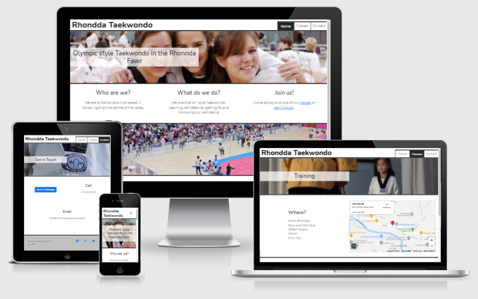
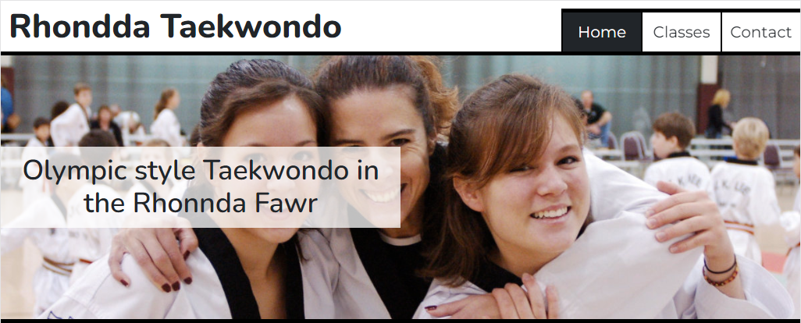
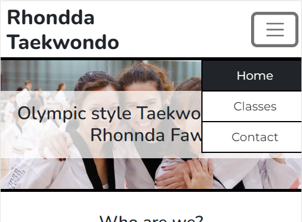
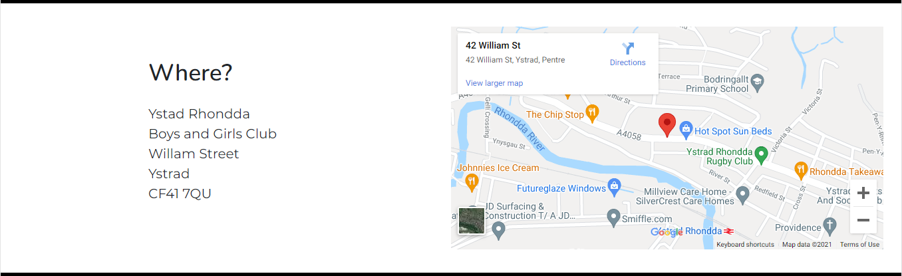
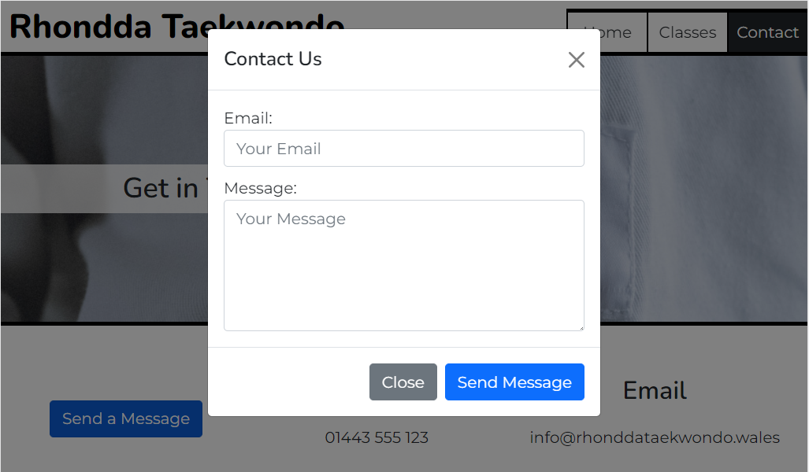
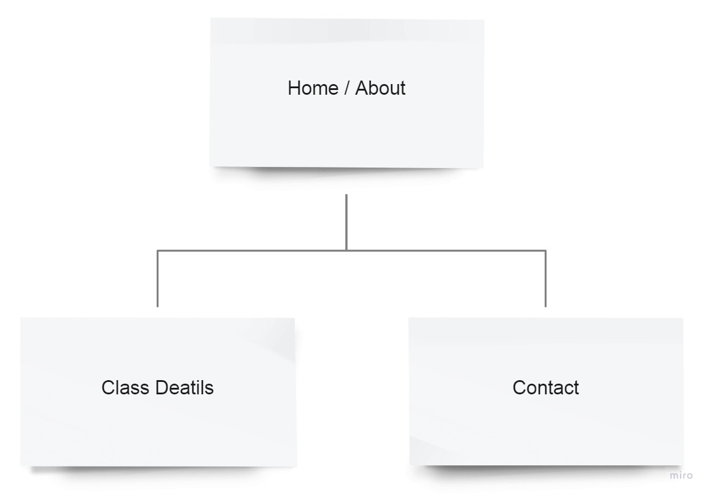
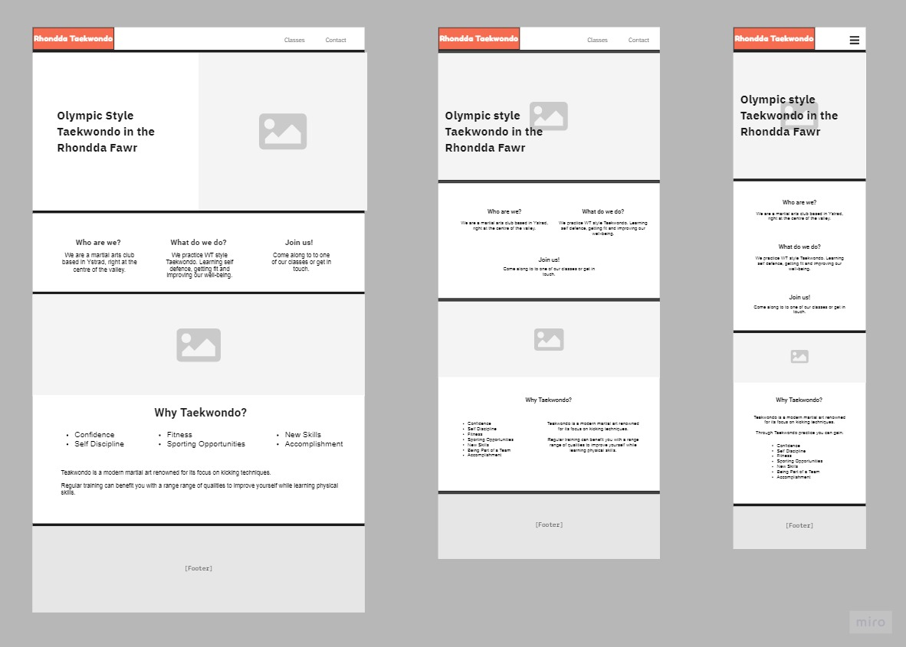

# Rhondda Taekwondo

A responsive website for a local martial arts club in the Rhondda valley. The the website serves as promotion for the club, a point to discover essential details about the classes and opportunities to make contact.

**The live project is available on GitHub Pages: [Rhondda Taekwondo](https://llewelyn-williams.github.io/rhondda-taekwondo/)**

## Table of Contents
- [Features](#features)
  * [Current Features](#current-features)
  * [Future Features](#future-features)
- [User Experience Design](#user-experience-design)
  * [Strategy](#strategy)
  * [Scope](#scope)
    + [Problems to Solve](#problems-to-solve)
    + [User Stories](#user-stories)
  * [Structure](#structure)
  * [Skeleton](#skeleton)
    + [Navigation Tree](#navigation-tree)
    + [Wireframes](#wireframes)
  * [Surface](#surface)
- [Technologies Used](#technologies-used)
  * [Languages](#languages)
  * [Frameworks](#frameworks)
  * [Other Services and Software](#other-services-and-software)
- [Testing](#testing)
  * [Functionality](#functionality)
  * [Usability](#usability)
  * [Responsiveness](#responsiveness)
  * [Unfixed Bugs](#unfixed-bugs)
- [Deployment Instructions](#deployment-instructions)
- [Acknowledgements](#acknowledgements)
  * [Content](#content)
  * [Media](#media)
  * [Thanks](#thanks)

## Features

The website features 3 pages designed to provide quick and simple access to basic information someone may need to help guide them towards joining the club.

### Current Features
These features have been implemented in the project.

 - Homepage
	 * A large hero image of taekwondo practitioners smiling widely, clearly enjoying themselves, showcases the excitement and fun that can be had from experiencing the martial art.
	 * Overlaid title clearly states what the website is about.
	 

 - Responsive Navigation Menu
	 * A collapsible menu, that hides behind a button on smaller devices.
	 * Hover CSS used on the buttons to add interaction feedback to the user.
	 

 - Google Maps
	 * An embedded interactive map from Google Maps.
	 * Allows the user to visually see the location and begin to plot their journey to a class.
	 

 - Contact Form
	 * A way of directly communicating with the club from the website itself. It only had two entry fields to keep the demands of the user as small as required.
	 * The form sits on a modal that can be accessed via a button on the contact page.
	 

### Future Features
Possible features to be considered for future releases.
- Blog / News
	 * A way for updates about events to be featured on the page, showcasing what the club is involved with.
	 * A place where ideas can be shared about Taekwondo practice at the club.

- Tutorials / Guides
	 * More detailed information about the club including the grading system, code of conduct etc.
	 * Video guides showing the poomsae (patterns/forms) of Taekwondo that need to be learnt for gradings.

## User Experience Design

### Strategy

The website is aimed at prospective students considering joining a martial arts club and parents looking to chose a martial arts club for their child or children.

Users will expect responsive design and seamless use of familiar conventions to access the information that they want to see as simply as possible.

Both the user and owner should mutually benefit from a sense on confidence being established in the club, leading to users being inspired to either join up or make contact.

### Scope

#### Problems to Solve
People currently don't know:
 - the club exists
 - what the club does
 - what the club offers
 - how to get it from the club
 
Neither are they:
 - joining the club
 - engaging with the club

The target is a website with low complexity, that is however visually and functionally well polished and creates a sense of trust.

#### User Stories

| Scenario | Requirements  |
|----------|---------------|
| **As a parent**, I want to see information about where the club is, when the classes run, what the cost is and what my child will learn, so I can assess if it is a good fit for our family. | The information they are looking for needs to be present and quick and simple to access. |
| I want to be able to ask questions I might have, to help me make a decision or get an even better picture of the club. | Provide method and means of contact.|
| I want to know my child will  be safe. | Provide details of how the club approaches safety. |
| **As a potential student**, I want to find out when the classes run, what the cost is and what I will learn, so I can assess if it is a good fit for myself. | The information they are looking for needs to be present and quick and simple to access.|
| I want to be able to ask questions, to find out more. | Provide method and means of contact.|
| I want to know what I will gain.  | Description of what the club offers. |
| **As an existing member** of the club I want to check details about the club, so that I can deepen my understanding of my role within it. | External links to further explore about the martial art of the club. |

### Structure

Three main pages or content areas can provide the functions required.
1. A landing page that quickly conveys the most basic information about the club establishes purpose.
2. An essential information area, with details of location, times and costs.
3. A contact area, with various contact options including a contact form inside a modal.

### Skeleton

#### Navigation Tree

#### Wireframes

Summary about wireframes.

The complete set of wireframes can be viewed in via these images:
 - [Home Wireframes](assets/wireframes/rhondda-taekwondo-home-wireframe.jpg)
 - [Classes Wireframes](assets/wireframes/rhondda-taekwondo-classes-wireframe.jpg)
 - [Contact Wireframes](assets/wireframes/rhondda-taekwondo-contact-wireframe.jpg)

### Surface

The design uses a predominately black and white colour scheme inspired by the dobok (taekwondo uniform) and the taegukgi (flag of South Korea). Clean straight lines with high contrast reflect the visual representation of taekwondo the work over as well as lending to the sense of efficiency and directness, reflected in the style of the martial art. Links are in blue, one of the other colours found on the taegukgi, the blue also serving its place as the web’s default colour for links, aiding speed of recognition.

## Technologies Used
### Languages
 - HTML 
 - CSS

### Frameworks
 - Bootstrap
 
### Other Services and Software
 - Git
 	 - Version control.
 - GitHub
 	 - Cloud-based storage and deployment via GitHub Pages.
 - GitPod
 	 - IDE.
 - [StackEdit](https://stackedit.io)
	 - Used to assist in the planning and creation of this README markdown file.
 - [markdown-toc](https://ecotrust-canada.github.io/markdown-toc)
	 - Used to generate table of contents in markdown for this README markdown file.
 - [miro](https://miro.com/)
	 - For the creation of [sitemap](#navigation-tree) and [wireframes](#wireframes).
 - [Gimp](https://www.gimp.org/)
	 - Editing, cropping, scaling of site images
 - [Dynamic Dummy Image Generator](https://dummyimage.com/)
	 - To provide placeholder images during development

## Testing

### Functionality

Interactive elements.
 1. Manual testing of the intactive elements of the website.
 2. Clicking on all internal and external links on all pages. Filling in the form, currently and, various ways incorrectly. Zooming and scrolling on Google Map.
 3. All internal and external links function as expected. Form validation is behaving as expected. Google Map is behaving as expected.
 
404 Test.  
 1. Testing functionality of 404 page
 2. Entering random letters into the address bar in place of a known page and attempting to navigate there.
 3. The 404 page displayed as a result. However, some changes that had been made to other HTML pages had not been made to the 404 page.
 4. Updated the footer text and styling to match the other pages.

### Usability

Accessibility.  
 1. Google Developer Tools - Lighthouse
 2. Running a LIghthouse Report
 3. Result showed a score of 97 for accessibility, picking up that some links did not feature text or alt-text.
 4. I added alt-text to the icons used as links in the footer. Upon retesting the result was still the same, so I moved the alt tags to the <a> tags, however this did not alter the result of the test either.

Compliance.  
 1. Testing that the HTML and CSS used is valid.
 2. Running the code through the [W3C HTML](https://validator.w3.org/) and [Jigsaw CSS](https://jigsaw.w3.org/css-validator/) validators
 3. There were no errors or warnings for the HTML at the end of the project. However, intermittent testing throughout development did identify the odd stray closing tag or small typos. The CSS validator also had no errors, however it did have warnings about unknown vendor extensions for “-webkit” transform and transition properties.
 4. Small typos and stray closing tags were corrected when discovered during development.

### Responsiveness

Ability to respond to screen size  
 1. Testing to see the difference in layout and behaviour on various screen sizes.
 2. Using Chrome Developer Tools to resize the viewport and observing the result.
 3. Throughout the development process the procedure was repeated and at many points the changes in layout observed were not desirable, elements would appear in places that were not aesthetically pleasing and often whitespace would be too much or too little.
 4. Amendments to the code were made after each testing to correct any issues observed with how the site responded.

### Unfixed Bugs

Using Bootstrap allowed for focused responsive design particularly at smaller screen sizes, but unfortunately did not add too much at the other end of the spectrum. As a result the design at very large resolutions is not as well structured as it is at smaller resolutions.

## Deployment Instructions

Deployment via GitHubPages

 1. Navigate to GitHub Repository
 2. Use the **Settings** link (cog icon) from the menu atop the repository.
 3. Use the **Pages** link from the left hand navigation menu.
 4. Select **Branch: master** as the source.
 5. Click **Save**
 6. The site can be found at the address `https://`**github-username**`.github.io/`**repository-name**

## Acknowledgements

### Content

Reused or inspired code from the following sources:
 - [Bootstrap Docs](https://getbootstrap.com/docs/5.0/)
 - [Hover.css](https://ianlunn.github.io/Hover/)
 - [StackOverflow Answers](https://stackoverflow.com/questions/5110249/wildcard-in-css-for-classes)
 - [W3C Schools Guide](https://www.w3schools.com/howto/howto_css_center-vertical.asp)

### Media

 - Smiling TKD Girls Home Page Hero Image by [Scott Feldstein](https://www.flickr.com/photos/scottfeldstein/278698683)
 - Taekwondo Area Home Page Image by [Legado OficialPE](https://www.flickr.com/photos/149051229@N03/49548468361)
 - Instrutor and Student Classes Page Image by [cottonbro](https://www.pexels.com/photo/woman-in-white-coat-standing-on-brown-wooden-floor-7991196/)
 - Uniform Badge Contact Page Image by [cottonbro](https://www.pexels.com/photo/person-in-white-button-up-shirt-5999201/)
 - Mockups Screenshot from [Am I Responsive](http://ami.responsivedesign.is/)

### Thanks

 - Code Institue
 - My Code Instute Mentor
 - My Long Suffering Parter